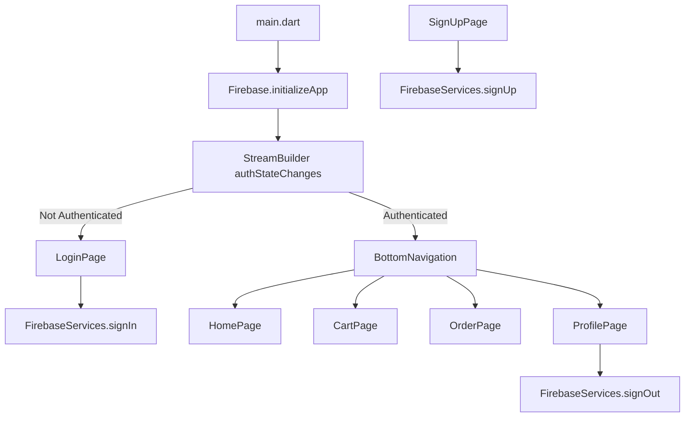
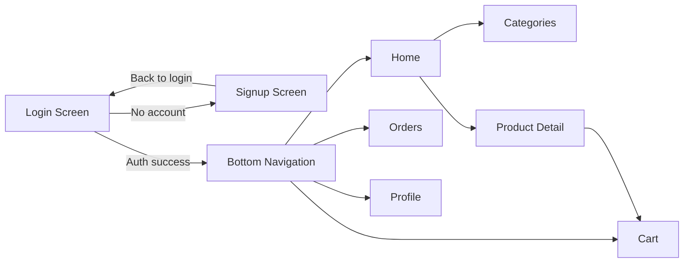
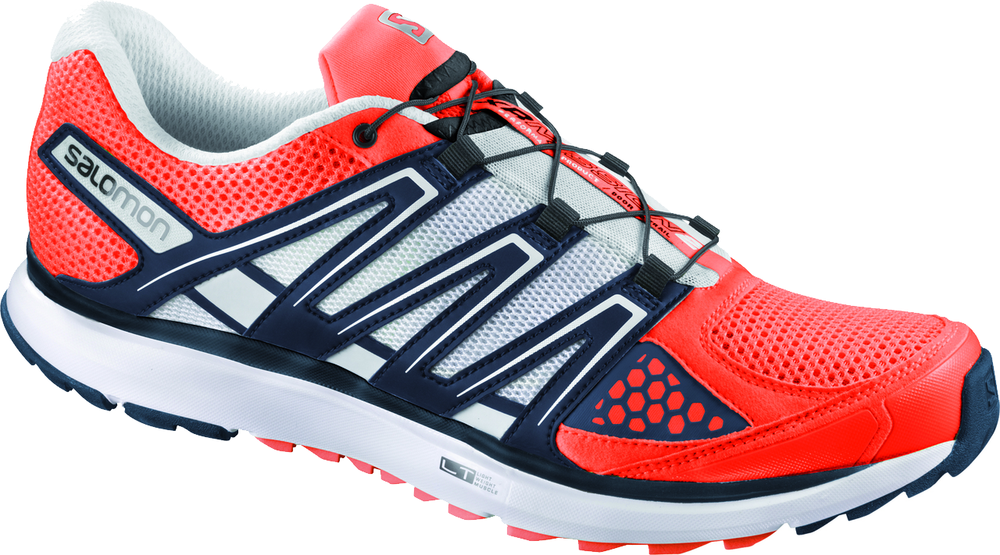
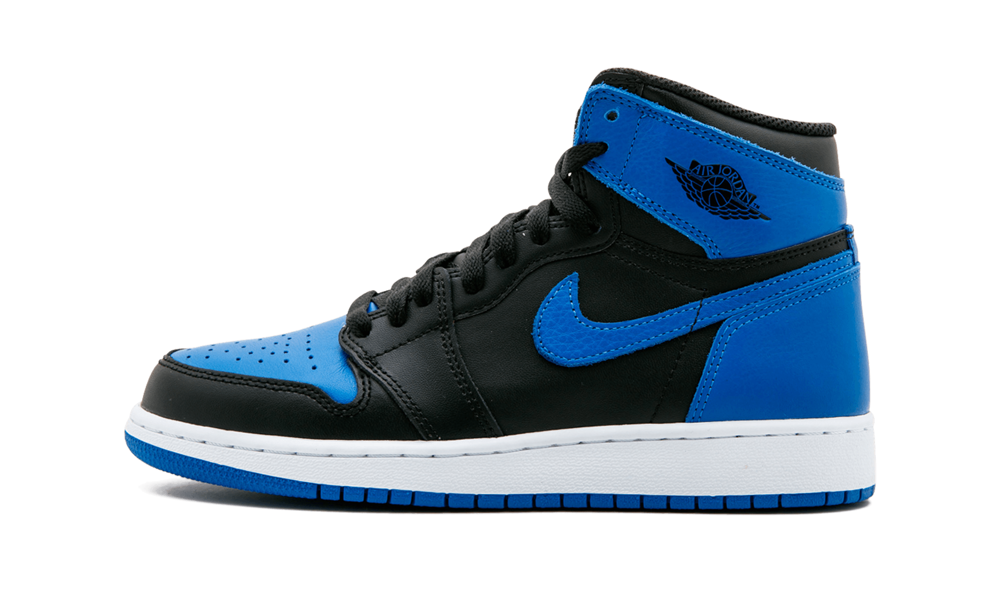

# Shopping App (Flutter + Firebase)

A mobile e-commerce demo app built with Flutter and Firebase Authentication, showcasing login/signup, product browsing, cart, orders, and profile management.

## Recruiter Snapshot

- **Project Type:** Flutter mobile app
- **Domain:** E-commerce UI + authentication flow
- **Architecture Style:** UI-driven screens with Firebase Auth service layer
- **Primary Value:** Demonstrates Flutter UI composition, navigation patterns, and Firebase auth integration

---

## Features Implemented

- Email/password **Sign Up** (Firebase Auth)
- Email/password **Login** (Firebase Auth)
- Auth state listener to route users to logged-in or logged-out flow
- Bottom navigation with 4 main modules:
  - Home
  - Cart
  - Orders
  - Profile
- Product listing and product detail views
- Add-to-cart navigation flow
- Sign out from profile

---

## Tech Stack

- **Framework:** Flutter (Dart)
- **Backend Service:** Firebase Authentication
- **Platforms configured:** Android, iOS, Web, Windows (via FlutterFire config metadata)
- **State handling:** StatefulWidgets + `setState` + `StreamBuilder`

---

## High-Level Architecture



### Screen Navigation Flow



---

## Folder Structure

```text
lib/
├── main.dart
├── firebase_services.dart
└── screens/
    ├── Login.dart
    ├── SingUp_page.dart
    ├── bottomnavigation.dart
    ├── HomePage.dart
    ├── Categories_page.dart
    ├── Detail_page.dart
    ├── Cart_page.dart
    ├── Order_page.dart
    └── profile_page.dart
```

---

## Module Breakdown

### 1) Entry and Auth Routing
- `lib/main.dart`
  - Initializes Firebase
  - Uses `FirebaseAuth.instance.authStateChanges()` to gate access
  - Routes to `BottomNavigation` (logged in) or `LoginPage` (logged out)

### 2) Authentication Service
- `lib/firebase_services.dart`
  - `signUp(email, password)`
  - `signIn(email, password, context)`
  - `signOut()`

### 3) UI Modules
- `HomePage.dart`: greeting, search bar, categories, product cards
- `Categories_page.dart`: product grid view
- `Detail_page.dart`: product details + add to cart CTA
- `Cart_page.dart`: cart item list
- `Order_page.dart`: active order list
- `profile_page.dart`: profile info + logout action
- `bottomnavigation.dart`: app shell with tab navigation

---

## UI Gallery

> The repository currently includes product image assets used by the UI. These are shown below.

| Product Assets |
|---|
|  |
|  |
|  |

### Expected App Screens

- Login Screen
- Signup Screen
- Home Screen
- Categories Screen
- Product Detail Screen
- Cart Screen
- Orders Screen
- Profile Screen

---

## Run Locally

### Prerequisites

- Flutter SDK (3.x)
- Dart SDK (bundled with Flutter)
- Firebase project
- FlutterFire CLI

### Setup

1. Install dependencies:

```bash
flutter pub get
```

2. Generate Firebase options (required because `lib/firebase_options.dart` is gitignored):

```bash
flutterfire configure
```

3. Run app:

```bash
flutter run
```

---

## Validation Commands

```bash
flutter analyze
flutter test
```

---

## Notes for Reviewers / Recruiters

- This project demonstrates complete app shell wiring and auth-gated navigation.
- Product/order/cart data is currently static UI data and can be extended to Firestore or REST APIs.
- The architecture is clean for early-stage prototype development and can be scaled by introducing dedicated state management (BLoC, Riverpod, Provider) and repository patterns.

---

## Improvement Opportunities

- Replace hardcoded UI data with backend-driven models
- Add form validation and user-facing error messages for auth
- Add unit/widget/integration tests aligned with current screens
- Improve accessibility and responsive layouts
- Add CI workflows for analyze/test on PRs
